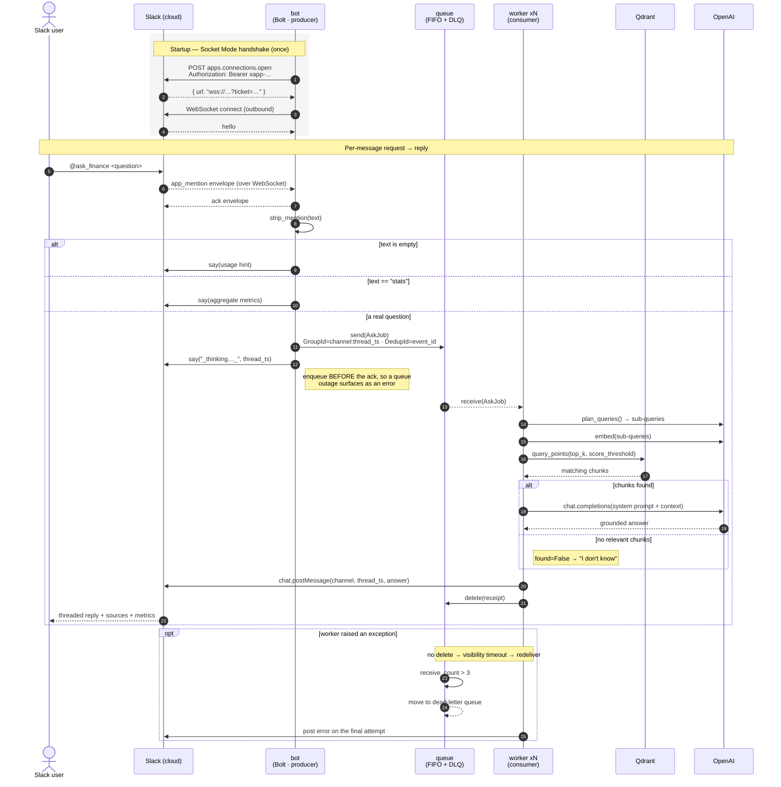

# rag-chatbot

A Slack bot that answers investment-strategy questions **strictly from a vector knowledge base**. It never answers from outside knowledge — if the corpus doesn't cover the question, it says so.

Mention the bot to ask a question, or `@ask_finance stats` for usage metrics.

```
@ask_finance compare EV/EBIT and O'Shaughnessy
```

---

## Table of contents

- [Architecture](#architecture)
- [Sequence flow](#sequence-flow)
- [How the bot connects to Slack](#how-the-bot-connects-to-slack)
- [Tech stack](#tech-stack)
- [Running with Docker](#running-with-docker)
- [Running without Docker](#running-without-docker)
- [Configuration](#configuration)
- [Slack app setup](#slack-app-setup)
- [Testing](#testing)
- [Known limitations](#known-limitations)

---

## Architecture

The bot **accepts** questions; workers **answer** them. Splitting those roles is what allows several questions to be answered at once.

```
Slack --app_mention--> bot --send--> queue --receive--> worker xN --> qdrant + OpenAI
                                                        worker --chat.postMessage--> Slack
```

Two invariants hold the design together, and they are enforced by configuration rather than convention:

- **The `bot` never touches Qdrant or OpenAI.** It has no `QDRANT_URL`. It strips the mention, pushes an `AskJob` onto the queue, and acks. That is all.
- **The `worker` never touches the WebSocket.** It has no socket connection. It drains the queue, runs retrieval and generation, and posts the answer using the Web API.

A worker that fails does **not** delete its message. The visibility timeout expires, the queue redelivers, and after three attempts the message lands in a dead-letter queue instead of poisoning the queue forever.

| Service | Role | Replicas |
|---|---|---|
| `qdrant` | Vector store (official image) | 1 |
| `queue` | ElasticMQ — SQS-compatible, FIFO + DLQ | 1 |
| `ingest` | One-shot: build/refresh the index, exit 0 | 1 |
| `bot` | Socket Mode listener → enqueue; answers `stats` inline | **1** (single socket) |
| `worker` | Drain queue → `answer()` → post to Slack | **N** |

Why only one `bot`? It holds a single outbound WebSocket. Scale the `worker` instead — that is where the time is spent.

Design notes and the full rationale live in [docs/superpowers/specs/](docs/superpowers/specs/).

---

## Sequence flow

Both phases: establishing the connection once at startup, then the per-message round trip.



The **"I don't know" path is a success**: it posts and deletes. Only an exception leaves a message on the queue.

---

## How the bot connects to Slack

The bot uses **Socket Mode**: it dials *out* to Slack and holds a persistent WebSocket. Slack never calls into you, so there is **no public URL, no inbound webhook, no ngrok, and no request-signature verification**.

### Two tokens, two jobs

They are independent credentials on independent channels. Confusing them is the most common setup error.

| Token | Setting | Prefix | Scope needed | Used for |
|---|---|---|---|---|
| **App-level token** | `SLACK_APP_TOKEN` | `xapp-…` | `connections:write` | Opening the WebSocket (inbound events) |
| **Bot token** | `SLACK_BOT_TOKEN` | `xoxb-…` | `app_mentions:read`, `chat:write` | Posting replies via the Web API (outbound) |

The `bot` service needs both. The `worker` service needs **only** the bot token — it posts, but never listens.

### The handshake, step by step

1. **`App(token=xoxb-…)`** builds the Bolt app and a Web API client authenticated with the **bot token**. This is what later sends replies.

2. **`SocketModeHandler(app, xapp-…).start()`** does the actual connecting:

   a. It calls Slack's `apps.connections.open` over HTTPS, presenting the **app-level token** as a bearer credential:
   ```
   POST https://slack.com/api/apps.connections.open
   Authorization: Bearer xapp-1-A0XXXX-…
   ```

   b. Slack looks the token up. **The token *is* the identity** — it was minted for exactly one `app_id` and stored server-side with its scopes. Slack resolves which app is calling, checks it holds `connections:write`, and rejects the call if the token is unknown, revoked, or under-scoped. There is no username, no password, no signature.

   c. On success Slack returns a **short-lived, single-use `wss://` URL** with an embedded ticket already bound to your app:
   ```
   wss://wss-primary.slack.com/link/?ticket=…&app_id=…
   ```

   d. The bot opens a WebSocket to that exact URL. **The connection is authenticated by the URL's ticket**, not by re-sending the token. Slack recognizes it because it minted that ticket moments earlier. From then on, only events belonging to *your app's* installations travel down that socket.

   e. Slack sends a `hello` frame. The connection is live and stays open.

3. **Event delivery.** When someone `@`-mentions the bot, Slack pushes an `app_mention` **envelope** down the socket. Bolt immediately **acks** the envelope so Slack does not retry it, then routes the event to the registered handler.

4. **Replying.** `say(...)` and the worker's `chat_postMessage(...)` are ordinary HTTPS calls to the Web API, authenticated with the **bot token** — a completely separate channel from the socket.

So the chain is: **secret app token → Slack maps it to your `app_id` and scopes → mints an app-bound socket URL → the URL's ticket authenticates every frame on that connection.**

### Consequences worth knowing

- **The app-level token is a bearer secret.** Anyone holding it can open a socket *as your app*. It lives in `.env` (gitignored), never in code. [`slack/app.py`](src/ragchat/slack/app.py) refuses to start without both tokens.
- **The signing secret plays no role here.** It exists to verify that inbound HTTP requests genuinely came from Slack. Socket Mode has no inbound requests, so there is nothing to verify. The bearer tokens do all the identity work.
- **A Socket Mode listener can never be a Lambda.** It holds a long-lived connection, so it must be a long-lived process. That is precisely why the `bot` is a container and only the answering stage is horizontally scaled.
- **Slack does not replay events.** A question asked while the bot is down is lost. Once accepted onto the queue, however, a job survives a bot or worker restart.

---

## Tech stack

| Layer | Choice | Why |
|---|---|---|
| Language | **Python 3.12** | |
| Packaging / env | **uv** + hatchling | Fast, lockfile-reproducible installs (`uv.lock`) |
| Slack | **slack-bolt** (Socket Mode) + **slack-sdk** | Outbound WebSocket; no public URL |
| Vector store | **Qdrant** (server; embedded fallback) | Server mode lets many processes share one index |
| Queue | **ElasticMQ** locally, **boto3** SQS client | Same client code against real AWS SQS — only the endpoint URL changes |
| Embeddings | OpenAI `text-embedding-3-small` (1536-d, cosine) | |
| Generation | OpenAI `gpt-4o-mini` | Also used as the cheap query planner |
| Config | **pydantic-settings** | Env-driven, typed, `.env`-aware |
| Models | **pydantic** | `AskJob`, `Answer`, `Chunk`, metrics |
| Containers | **Docker Compose** | Five services; `worker` scales |
| Tests | **pytest** | 54 tests, no network required |

**Retrieval pipeline.** A cheap LLM planner decomposes a comparison question into one focused sub-query per item; each is embedded and searched separately; hits are merged with a score threshold, a per-document cap, and dedup by best score. Generation is then strictly grounded in those chunks.

**Ingestion** is incremental: documents are hashed (sha256) into `manifest.json`, and unchanged documents are skipped. Point ids are deterministic (`uuid5`), so re-ingesting is idempotent.

---

## Running with Docker

```bash
cp .env.example .env        # fill in OPENAI_API_KEY, SLACK_BOT_TOKEN, SLACK_APP_TOKEN
docker compose up --build   # qdrant, queue, ingest, bot, worker x3
```

Startup order is enforced: `qdrant` starts, `ingest` builds the index and **exits 0**, and only then do `bot` and the workers start. A successful `ingest` *is* the readiness gate.

Change concurrency, or watch the workers pick up jobs:

```bash
docker compose up --build --scale worker=5
docker compose logs -f worker
```

Read the aggregate metrics that the workers have been appending:

```bash
docker compose exec bot ragchat stats
```

No AWS account is needed. Compose supplies dummy AWS credentials, because `boto3` refuses to sign a request without them even though ElasticMQ ignores their values.

---

## Running without Docker

With `QDRANT_URL` and `QUEUE_URL` unset, the app falls back to an embedded on-disk Qdrant and an in-process queue — so the CLI works with nothing else running.

```bash
uv sync
uv run ragchat ingest                                # build the index under ./data
uv run ragchat ask "what is the acquirer's multiple?"
uv run ragchat stats
uv run pytest
```

---

## Configuration

Everything is environment-driven via [`common/config.py`](src/ragchat/common/config.py).

| Variable | Default | Notes |
|---|---|---|
| `OPENAI_API_KEY` | — | Required |
| `SLACK_BOT_TOKEN` | — | `xoxb-…`; required by `bot` and `worker` |
| `SLACK_APP_TOKEN` | — | `xapp-…`; required by `bot` only |
| `QDRANT_URL` | `""` | Empty ⇒ embedded on-disk mode |
| `QUEUE_URL` | `""` | Empty ⇒ in-memory queue |
| `QUEUE_ENDPOINT_URL` | `""` | Set ⇒ ElasticMQ; empty ⇒ real AWS SQS |
| `WORKER_WAIT_SECONDS` | `20` | Long-poll duration |
| `MAX_RECEIVE_COUNT` | `3` | Must match the queue's DLQ redrive policy |
| `TOP_K` / `SCORE_THRESHOLD` | `5` / `0.30` | Retrieval tunables |
| `DATA_DIR` | auto | `/app/data` in the container |

The queue's **visibility timeout** is queue-side configuration ([`elasticmq.conf`](elasticmq.conf)), not a client setting. It must exceed the slowest answer, or the queue redelivers a job while a worker is still running it.

---

## Slack app setup

Full walkthrough in [docs/slack-setup.md](docs/slack-setup.md). In short:

1. **Socket Mode: enabled.** Otherwise `apps.connections.open` fails.
2. **App-level token** with scope `connections:write` → your `xapp-…`.
3. **Event Subscriptions** → subscribe to the bot event `app_mention`.
4. **Bot token scopes**: `app_mentions:read` (receive the mention) and `chat:write` (post the reply) → your `xoxb-…`.
5. Invite the bot to the channel: `/invite @ask_finance`.

---

## Testing

```bash
uv run pytest        # 54 tests, no network, no Docker
```

The queue is behind a `JobQueue` protocol with an in-memory implementation, so the producer, the consumer, and the retry/DLQ semantics are all unit-tested offline. Qdrant tests run against a temp directory in embedded mode.

Unit tests cannot cover the process boundaries. Smoke-test the real thing:

```bash
docker compose up --build --scale worker=3
# post three separate top-level mentions in Slack, then:
docker compose logs worker | grep chat/completions   # different containers answer in parallel
docker compose exec bot ragchat stats                # bot reads what the workers wrote
```

---

## Known limitations

These are deliberate choices, not oversights.

- **`bot` is a single replica**, so it is a single point of failure for *accepting* work. Queued jobs survive a restart; questions asked while it is down are lost, because Slack does not replay them.
- **Duplicate answers are possible** if a worker dies between posting to Slack and deleting the message. Eliminating this would need a distributed transaction across Slack and SQS. A rare duplicate answer is preferable to a silently lost one.
- **ElasticMQ is a local stand-in.** Its dead-letter queue name must *not* end in `.fifo` (real AWS SQS requires the opposite), so `elasticmq.conf` is not an AWS template. Moving to real SQS is a `QUEUE_ENDPOINT_URL` change plus provisioning — no code change.
- **`ingest` is one-shot.** Corpus changes require re-running that service.
- **The bot is stateless.** No thread memory, no follow-up questions.
